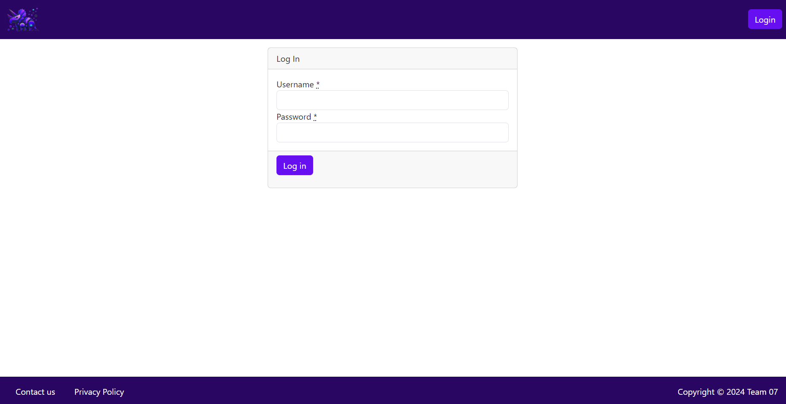
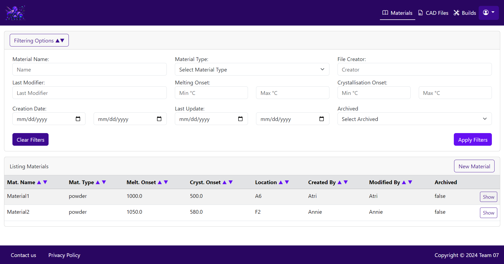
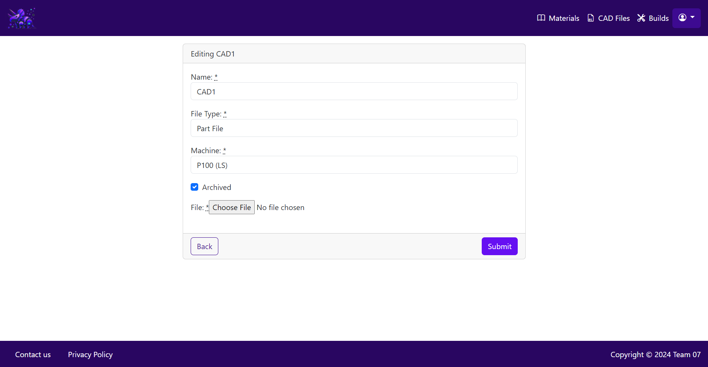
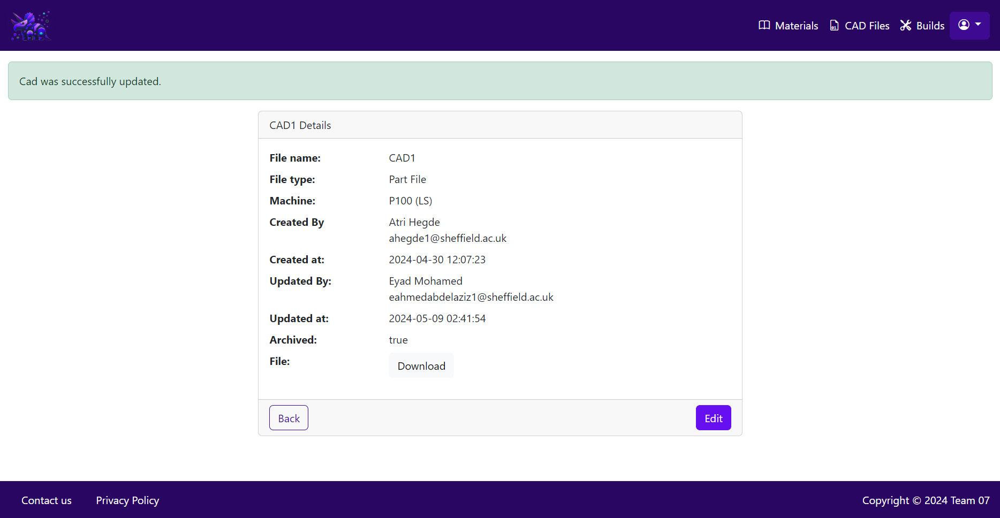
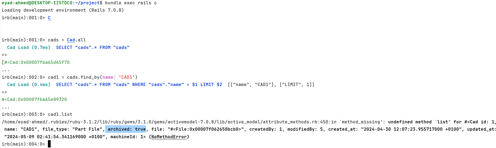

# Why we created this file
In this file, we describe the testing that we manually performed on the final version of our project to make sure it is working and to cover for the RSpec sheets that we could not create for some controllers within the project's timeframe.

#  Profile Controller
1. I visited "/profile"
2. I was redirected to login page (as expected)
3. I Logged in as an admin
4. My Logged in user profile details were displayed correctly as expected
5. **Test Passed**

# Users Controller
## GET /users

1. I visited "/users"
2. I was redirected to login page (as expected)
3. I Logged in as an admin
4. The users page was displayed correctly (as expected)
5. Each button clicked directed me to the correct route/link/page
6. **Test Passed**

## Updating users

1. I changed the role of the one of the users displayed on the page
2. I Clicked update
3. I checked the database and found that it was correctly updated as requested
4. Each button clicked directed me to the correct route/link/page
5. **Test Passed**

## Filtering Users

1. I typed "Eyad" in the name field inside the filters
2. I clicked on the search button
3. Only the user with name Eyad was displayed (as expected)
4. I clicked on "clear filters"
5. all users were displayed back again
6. Each button clicked directed me to the correct route/link/page
7. **Test Passed**

# Materials Controller

## GET /materials

1. I visited "/materials"
2. I was redirected to login page (as expected)
3. I Logged in as an admin
4. The materials page was displayed correctly with all the materials in the database shown (since the admin user has access to all of them)  (as expected)
5. Each button clicked directed me to the correct route/link/page
6. **Test Passed**

## GET /materials/1

1. I clicked on the "show" button of one of the materials
2. All the material's (of which I clicked the show button) details were displayed correctly in the "/materials/1" route (as expected)
3. All download buttons worked as expected
4. Each button clicked directed me to the correct route/link/page
5. **Test Passed**

## GET /materials/new

1. I returned back to "/materials"
2. I Clicked on "new material" button
3. This directed me to the "/materials/new" page with the correct form and details to be filled
4. I filled in the required fields with valid input and clicked submit
5. The new material was added to the database successfully (as expected)
6. Each button clicked directed me to the correct route/link/page
7. **Test Passed**

## Editing Materials

1. I returned back to "/materials"
2. I clicked on show button for one of the materials
3. I clicked Edit
4. I checked the "archived" field (set it to true)
5. I clicked submit
6. The database was updated successfully and the view was also displayed correctly (as expected)
7. Each button clicked directed me to the correct route/link/page
8. **Test Passed**

# CADs Controller

## GET /cads

1. I visited "/cads"
2. I was redirected to login page (as expected)
3. I Logged in as an admin
4. The CADs page was displayed correctly with all the CADs in the database shown (since the admin user has access to all of them)  (as expected)
5. Each button clicked directed me to the correct route/link/page
6. **Test Passed**

## GET /cads/1

1. I clicked on the "show" button of one of the CAD Designs
2. All the CAD's (of which I clicked the show button) details were displayed correctly in the "/cads/1" route (as expected)
3. The download button worked as expected
4. Each button clicked directed me to the correct route/link/page
5. **Test Passed**

## GET /cads/new

1. I returned back to "/cads"
2. I Clicked on "new CAD" button
3. This directed me to the "/cads/new" page with the correct form and details to be filled
4. I filled in the required fields with valid input and clicked submit
5. The new CAD was added to the database successfully (as expected)
6. Each button clicked directed me to the correct route/link/page
7. **Test Passed**

## Editing CADs

1. I returned back to "/cads"
2. I clicked on show button for one of the CADs
3. I clicked Edit
4. I checked the "archived" field (set it to true)
5. I clicked submit
6. The database was updated successfully and the view was also displayed correctly (as expected)
7. Each button clicked directed me to the correct route/link/page
8. **Test Passed**

# Machines Controller

## GET /machines

1. I visited "/machines"
2. I was redirected to login page (as expected)
3. I Logged in as an admin
4. The machines page was displayed correctly with all the machines in the database shown (since the admin user has access to all of them)  (as expected)
5. Each button clicked directed me to the correct route/link/page
6. **Test Passed**

## GET /machines/1

1. I clicked on the "show" button of one of the machines
2. All the machines (of which I clicked the show button) details were displayed correctly in the "/machines/1" route (as expected)
3. Each button clicked directed me to the correct route/link/page
4. **Test Passed**

## GET /machines/new

1. I returned back to "/machines"
2. I Clicked on "New Machine" button
3. This directed me to the "/machines/new" page with the correct form and details to be filled
4. I filled in the required fields with valid input and clicked submit
5. The new machine was added to the database successfully (as expected)
6. Each button clicked directed me to the correct route/link/page
7. **Test Passed**

## Editing Machines

1. I returned back to "/machines"
2. I clicked on show button for one of the Machines
3. I clicked Edit
4. I checked the "archived" field (set it to true)
5. I clicked submit
6. The database was updated successfully and the view was also displayed correctly (as expected)
7. Each button clicked directed me to the correct route/link/page
8. **Test Passed**

# Parameters Controller

## GET /parameters

1. I visited "/parameters"
2. I was redirected to login page (as expected)
3. I Logged in as an admin
4. The parameters page was displayed correctly with all the parameters in the database shown (since the admin user has access to all of them)  (as expected)
5. Each button clicked directed me to the correct route/link/page
6. **Test Passed**

## GET /parameters/1

1. I clicked on the "show" button of one of the parameters
2. All the parameters (of which I clicked the show button) details were displayed correctly in the "/parameters/1" route (as expected)
3. Each button clicked directed me to the correct route/link/page
4. **Test Passed**

## GET /parameters/new

1. I returned back to "/parameters"
2. I Clicked on "New parameter" button
3. This directed me to the "/parameters/new" page with the correct form and details to be filled
4. I filled in the required fields with valid input and clicked submit
5. The new parameter was added to the database successfully (as expected)
6. Each button clicked directed me to the correct route/link/page
7. **Test Passed**

# Builds Controller

## GET /builds

1. I visited "/builds"
2. I was redirected to login page (as expected)
3. I Logged in as an admin
4. The builds page was displayed correctly with all the builds in the database shown (since the admin user has access to all of them)  (as expected)
5. Each button clicked directed me to the correct route/link/page
6. **Test Passed**

## GET /builds/1

1. I clicked on the "show" button of one of the builds
2. All the builds (of which I clicked the show button) details were displayed correctly in the "/builds/1" route (as expected)
3. Each button clicked directed me to the correct route/link/page
4. **Test Passed**

## GET /builds/new

1. I returned back to "/builds"
2. I Clicked on "New build" button
3. This directed me to the "/builds/new" page with the correct form and details to be filled
4. I filled in the required fields with valid input and clicked submit
5. The new build was added to the database successfully (as expected)
6. Each button clicked directed me to the correct route/link/page
7. **Test Passed**

## Editing builds

1. I returned back to "/builds"
2. I clicked on show button for one of the builds
3. I clicked Edit
4. I checked the "completed" field (set it to true)
5. I clicked submit
6. The database was updated successfully and the view was also displayed correctly (as expected)
7. Each button clicked directed me to the correct route/link/page
8. **Test Passed**
